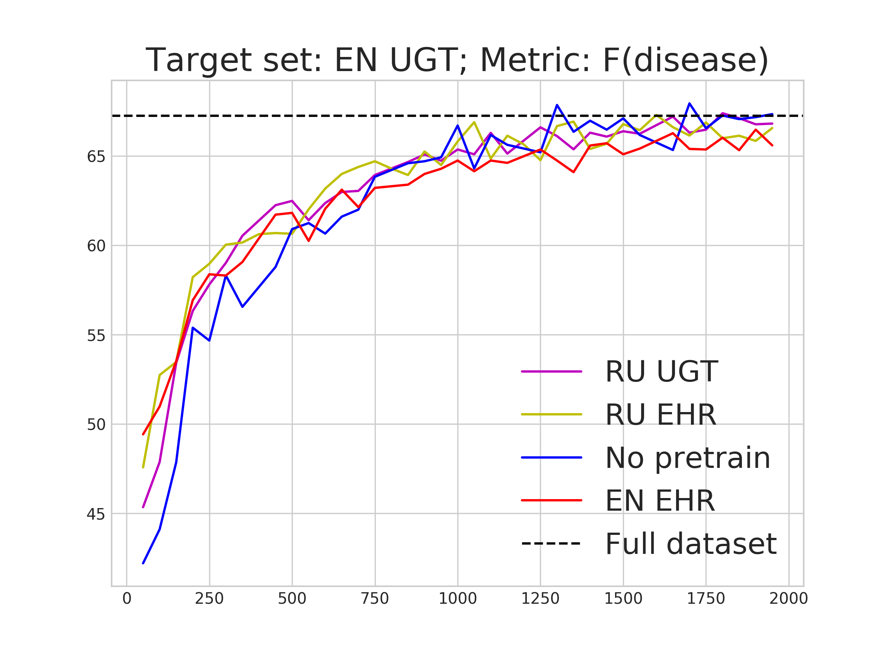
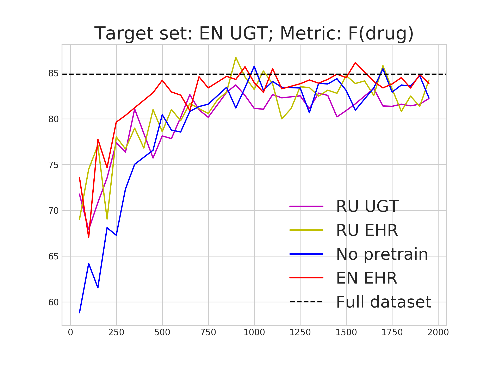
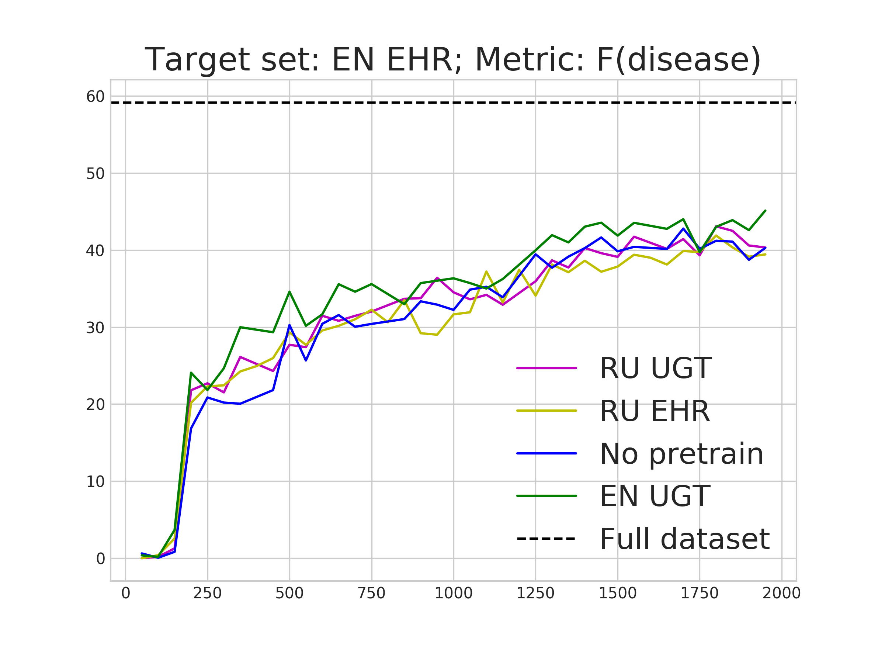
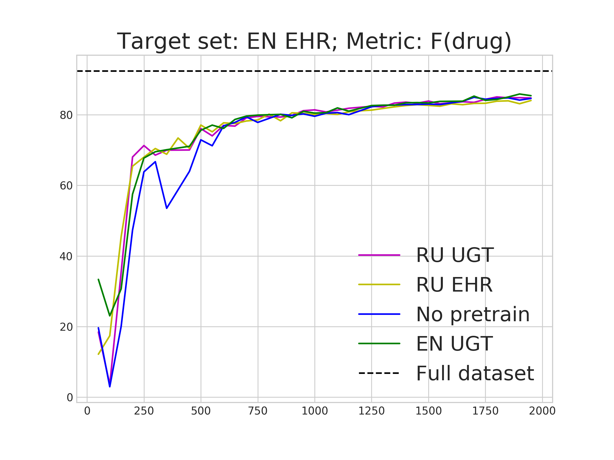
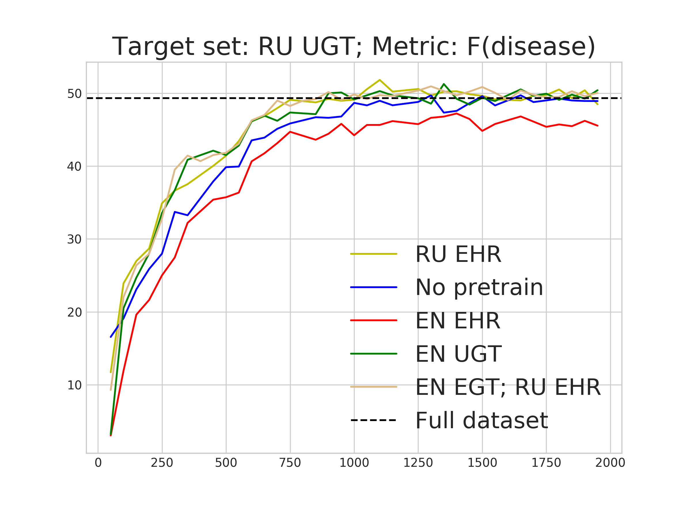
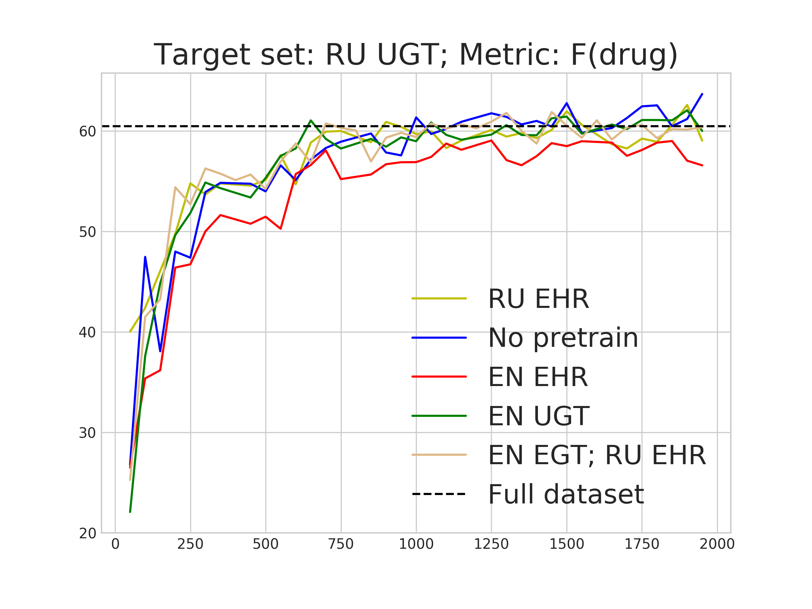
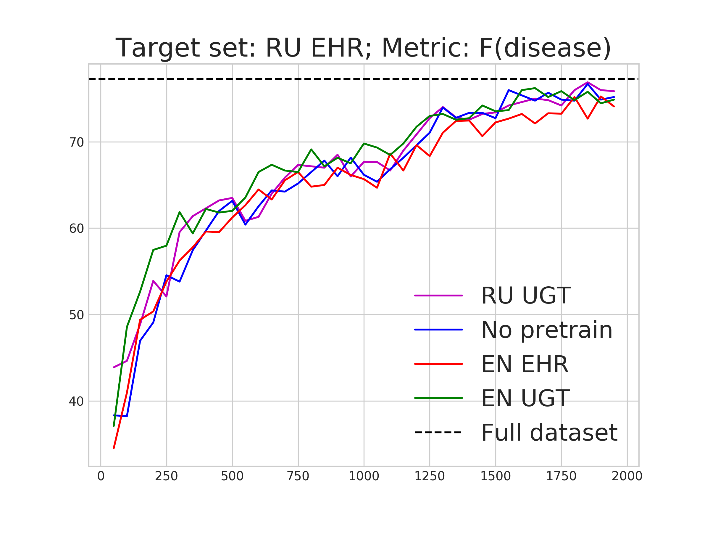
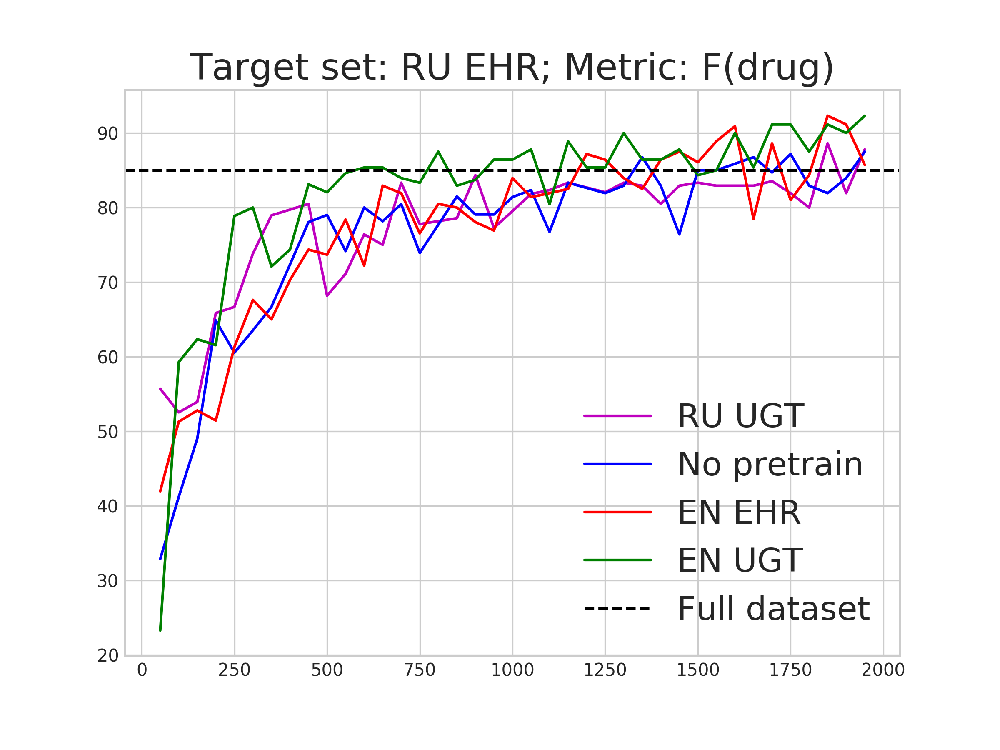

On Biomedical Named Entity Recognition:Experiments in Interlingual Transfer for Clinicaland Social Media Texts
---

<p style="text-align: center;">
Overview: This repository contains additional materials of the paper "On Biomedical Named Entity Recognition: Experiments 
in Interlingual Transfer for Clinical and Social Media Texts" [1]
</p>


In the the study 4 datasets were used
1. [CADEC](https://yadi.sk/d/KEY1WrQTC1SQCQ)
2. [N2C2](https://portal.dbmi.hms.harvard.edu/projects/n2c2-nlp/)
3. [Russian Reviews](https://github.com/dartrevan/medical_text_processing/blob/master/dataset/russian_reviews.tar.gz)
4. [Russian Electronic Health Records](http://nlp.isa.ru/datasets/clinical)

The source code of BioBERT NER model: https://github.com/dmis-lab/biobert \
The source code of BERT multilingual model: https://storage.googleapis.com/bert_models/2018_11_23/multi_cased_L-12_H-768_A-12.zip \
200-dim word embeddings trained on 2.5M user-generated posts about health problems [2]: https://github.com/dartrevan/ChemTextMining/blob/master/word2vec/Health_2.5mreviews.s200.w10.n5.v15.cbow.bin 

---

#### Table 1

---

<p style="text-align: center;">
This table presents the summary statistics of four corpora. For each corpus Disease and Drug entities' subtypes are given. In the study, all of the entity types presented in the "disease subtypes" column were merged into a single primary type named \emph{Disease}. Summary of each dataset includes the number of Drug and Disease entities, the number of documents and sentences, the average length of a document (in sentences), the average length of a sentence (in tokens), the average length of a Drug/Disease entity (in tokens).  
</p>

| Corpus               | Disease subtypes                      | Drug              | # doc. | # sent. | Avg. doc. len. | Avg. sent. len | Avg. Drug len | Avg. Dis. len |
|----------------------|---------------------------------------|-------------------|--------|---------|----------------|----------------|---------------|---------------|
| CADEC (EN UGT)       | ADR, Symptom, Disease, Finding (6590) | Drug (1798)       | 1249   | 7670    | 6.14           | 8.27           | 1.11          | 2.48          |
| n2c2 (EN EHR)        | ADE, Reason (7984)                    | Drug (26797)      | 503    | 70960   | 140.51         | 11.32          | 1.18          | 1.80          |
| Our dataset (RU UGT) | ADR, Disease (2429)                   | Medication (1195) | 400    | 4230    | 10.57          | 6.82           | 1.26          | 2.22          |
| RU EHR               | Disease, Symptom,(7874)               | Drug (3479)       | 159    | 16835   | 105.86         | 6.14           | 1.27          | 2.91          |
---

#### Table 2 

---

<p style="text-align: center;">
Table 2 shows the performance of baseline models in "in-corpus" mode for Disease entities. 
</p>

| Corpus         	| Models                            	| P                     	| R                        	|  F                       	| 
|----------------	|-----------------------------------	|-------------------------	|-------------------------	|-------------------------	|
| EN EHR (n2c2)  	| Multi-BERT<br>BioBERT<br>LSTM-CRF 	| 55.05<br>56.33<br>55.00 	| 63.91<br>65.56<br>56.95 	| 59.15<br>60.60<br>55.96 	| 
| EN UGT (cadec) 	| Multi-BERT<br>BioBERT<br>LSTM-CRF 	| 65.62<br>67.14<br>64.68 	| 68.96<br>69.88<br>62.77 	| 67.25<br>68.48<br>63.71 	| 
| RU UGT         	| Multi-BERT<br>LSTM-CRF            	| 45.93<br>27.78          	| 53.33<br>17.44          	| 49.35<br>21.43          	| 
| RU EHR         	| Multi-BERT<br>LSTM-CRF            	| 78.61<br>62.00          	| 75.96<br>61.69          	| 77.26<br>61.85          	| 
---

#### Table 3 

---

<p style="text-align: center;">
Table 3 shows the performance of baseline models in the "in-corpus" mode for Drug entities measured by Precision (P), Recall (R), and F1-score (F). 
</p>

| Corpus         	| Models                            	|P                       	| R                        	|  F                       	|
|----------------	|-----------------------------------	|-------------------------	|-------------------------	|-------------------------	|
| EN EHR (n2c2)  	| Multi-BERT<br>BioBERT<br>LSTM-CRF 	|92.21<br>92.39<br>89.87 	| 92.58<br>92.97<br>89.70 	| 92.39<br>92.68<br>89.79 	|
| EN UGT (cadec) 	| Multi-BERT<br>BioBERT<br>LSTM-CRF 	|79.40<br>87.27<br>78.50 	| 91.18<br>91.73<br>70.41 	| 84.88<br>89.44<br>74.23 	|
| RU UGT         	| Multi-BERT<br>LSTM-CRF            	|58.85<br>37.74          	| 62.14<br>40.31          	| 60.45<br>38.98          	|
| RU EHR         	| Multi-BERT<br>LSTM-CRF            	|87.18<br>62.00          	| 82.93<br>79.49          	| 85.00<br>69.66          	|
---

#### Table 4

---

<p style="text-align: center;">
Table 4 shows the "out-of-corpus" model performance in zero-shot mode for Disease entities measured by Precision (P), Recall (R), and F1-score (F). 
</p>

| Train Corpus  | Target corpus                	| P                      	| R                       	| F                       	|
|------------   |------------------------------	|------------------------	|-------------------------	|-------------------------	|
| EN UGT 	    | EN EHR <br>RU UGT <br>RU EHR 	| 43.05<br>20.61<br>7.73 	| 7.47<br>29.07<br>44.33  	| 12.73<br>24.12<br>13.17 	|
| EN EHR 	    | EN UGT <br>RU UGT <br>RU EHR 	| 2.25<br>0.77<br>3.33   	| 51.58<br>12.84<br>2.85  	| 4.32<br>1.44<br>3.07    	|
| RU UGT 	    | EN EHR <br>EN UGT <br>RU EHR 	| 11.9<br>31.98<br>10.22 	| 3.23<br>46.41<br>41.37  	| 5.08<br>37.94<br>16.4   	|
| RU EHR 	    | EN EHR <br>RU UGT <br>EN UGT 	| 0.5<br>24.88<br>43.78  	| 20.00<br>40.65<br>28.12 	| 0.97<br>30.86<br>34.24  	|
---

#### Table 5

--- 
<p style="text-align: center;">
Table 5 shows the "out-of-corpus" model performance in zero-shot mode for Drug entities measured by Precision (P), Recall (R), and F1-score (F).
</p>

| Train Corpus  | Target corpus                	| P                       	| R                       	| F                       	|
|--------	    |------------------------------	|-------------------------	|-------------------------	|-------------------------	|
| EN UGT 	    | EN EHR <br>RU UGT <br>RU EHR 	| 58.23<br>23.45<br>5.81  	| 71.9<br>29.97<br>91.18  	| 64.35<br>26.31<br>10.92 	|
| EN EHR 	    | EN UGT <br>RU UGT <br>RU EHR 	| 78.09<br>42.5<br>5.35   	| 76.09<br>29.43<br>72.65 	| 77.08<br>34.78<br>9.97  	|
| RU UGT 	    | EN EHR <br>EN UGT <br>RU EHR 	| 14.63<br>23.22<br>28.75 	| 75.3<br>83.22<br>44.27  	| 24.50<br>36.31<br>34.86 	|
| RU EHR 	    | EN EHR <br>RU UGT <br>EN UGT 	| 46.15<br>17.95<br>35.90 	| 37.5<br>17.95<br>23.73  	| 41.38<br>17.95<br>28.67 	|
---

#### Table 6

---
<p style="text-align: center;">
In Table 6 summary statistics of Byte Pair Encoding (BPE) tokens of entities in four datasets are presented. Summary includes the number of unique BPE tokens, intersection between un. tokens, percentage of shared tokens from unique set.
</p>


| Dataset D1 	| Dataset D2 	| Entity type 	| # unique BPE in D1 	| # unique BPE in D2 	| D1 intersection D2 	| % from D1 	| % from D2 	|
|-----------	|------------	|-------------	|--------------------	|--------------------	|--------------------	|-----------	|-----------	|
| EN UGT    	| EN EHR     	| Drug      	| 528                	| 2401               	| 410                	| 78%       	| 17%       	|
| EN UGT    	| EN EHR     	| Disease     	| 2338               	| 2491               	| 1172               	| 50%       	| 47%       	|
| RU UGT    	| RU EHR     	| Drug      	| 696                	| 896                	| 381                	| 55%       	| 43%       	|
| RU UGT    	| RU EHR     	| Disease     	| 1487               	| 2427               	| 1011               	| 68%       	| 42%       	|
---

#### Table 7

---

<p style="text-align: center;">
Table 7 performs a summary of the number of training sentences needed to achieve 99% of the full dataset performance with pretrained Multi-BERT. We compared the performance of two models: (i) trained on a full target dataset (ii) pretrained on whole source dataset and trained on a subset of the target dataset. For each pretraining setup, we record the size of the subset when the model achieves at least 99\% of the F1-measure performed on the full dataset, and there was no statistical significance between the models' results. The statistical significance was measured with a t-test with the level at 0.05. It should be noted that pretrained models require only 10-20% of the target dataset to achieve results as good as full dataset performances. 
</p>

| pre-train Corpus                                    	| Entity type                   	| EN UGT               	| RU UGT             	| RU EHR               	|
|-----------------------------------------------------	|-------------------------------	|----------------------	|--------------------	|----------------------	|
| best pre-train <br>worst pre-train <br>no pre-train 	| Drug<br>Drug<br>Drug          	| 500<br>900<br>1050   	| 700<br>650<br>1000 	| 550<br>1200<br>1500  	|
| best pre-train <br>worst pre-train <br>no pre-train 	| Disease<br>Disease<br>Disease 	| 1050<br>1050<br>1300 	| 700<br>900<br>1100 	| 1850<br>1850<br>1850 	|

<p style="text-align: center;">
Here is best pre-train is the model that was pretrained on a dataset that showed the best results in the number of sentences 
needed to achieve 99% of full dataset F-measure. Similarly for worst pre-train. no pre-train is model that was trained from
scratch.
</p> 

---

<p style="text-align: center;">
Figures below show the performance of  Multi-BERT models with pretraining on the source dataset (a corpus name is in the legend) and without pretraining (“No pretrain” line) for the EN UGT, RU UGT, RU EHR datasets. 
Y-axis: F1-scores for detection of Drug or Disease mentions, X-axis: the number of sentences used for training.
</p>



 


Conclusion:
---
We studied the task of recognition of drug and disease mentions in English and a low-resource language in the 
biomedical area, using a newly collected Russian corpus of user reviews about drugs (RU UGT) with 3,624 manually 
annotated entities.
 
We ask: can additional pretraining on an existing dataset be helpful for bioNER performance of multilingual BERT-based
NER model on a new dataset with a small number of labeled examples if the domain, the language, or both shift between
these datasets? Our study consisted of over 720 models trained on different subsets of two corpora in English and 
two corpora in Russian. For each language, we experimented with the clinical domain, i.e., electronic health records,
and the social media domain, i.e., reviews about drug therapy. As expected, models with pretraining on data in the
same language or the same domain obtain better results in zero-shot or few-shot settings. To our surprise, we found
that pretraining on data with two shifts can be effective. The model with the best pretraining achieves 99\% of the 
full dataset performance using only 23.56\% of the training data on our RU URT corpus, while the model with 
pretraining on data with two shifts (the EN EHR set) used 26.1\% of the training data. The model without pretraining
achieves similar results on the RU URT corpus using 31.97\% of the training set. 

We foresee three directions for future work. First, transfer learning and multi-task strategies on three and more 
domains remain to be explored. Second, a promising research direction is the evaluation of multilingual BERT on a 
broad set of entities. Third, future research will focus on the creation of fine-grained entity types in our corpus 
of Russian reviews that can help in finding associations between drugs and adverse drug reactions.

Citations:
---

[1] Miftahutdinov Z. et al. On Biomedical Named Entity Recognition:Experiments in Interlingual Transfer for Clinicaland Social Media Texts //European Conference on Information Retrieval. – Springer, Cham, 2020.

```
@ARTICLE{ecir2020,
    author={Miftahutdinov, Z. and Alimova, I. and Tutubalina, E.},
    title={On Biomedical Named Entity Recognition:Experiments in Interlingual Transfer for Clinicaland Social Media Texts},
    journal={European Conference on Information Retrieval},
    year={2020},
    volume={LNCS},
}
```

[2] Tutubalina E. V. et al. Using semantic analysis of texts for the identification of drugs with similar therapeutic effects //Russian Chemical Bulletin. – 2017. – Vol. 66. – №. 11. – Pp. 2180-2189.

```
@article{tutubalina2017using,
  title={Using semantic analysis of texts for the identification of drugs with similar therapeutic effects},
  author={Tutubalina, EV and Miftahutdinov, Z Sh and Nugmanov, RI and Madzhidov, TI and Nikolenko, SI and Alimova, IS and Tropsha, AE},
  journal={Russian Chemical Bulletin},
  volume={66},
  number={11},
  pages={2180--2189},
  year={2017},
  publisher={Springer}
}
```
